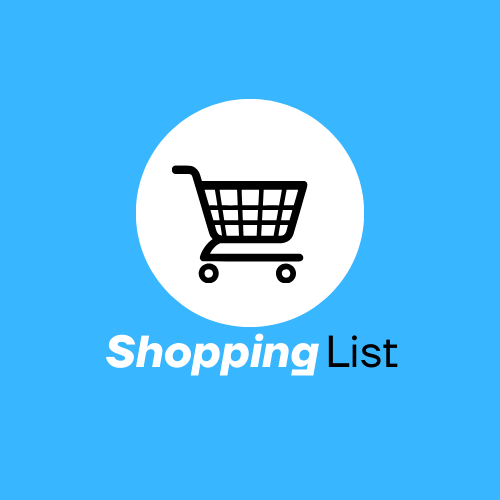
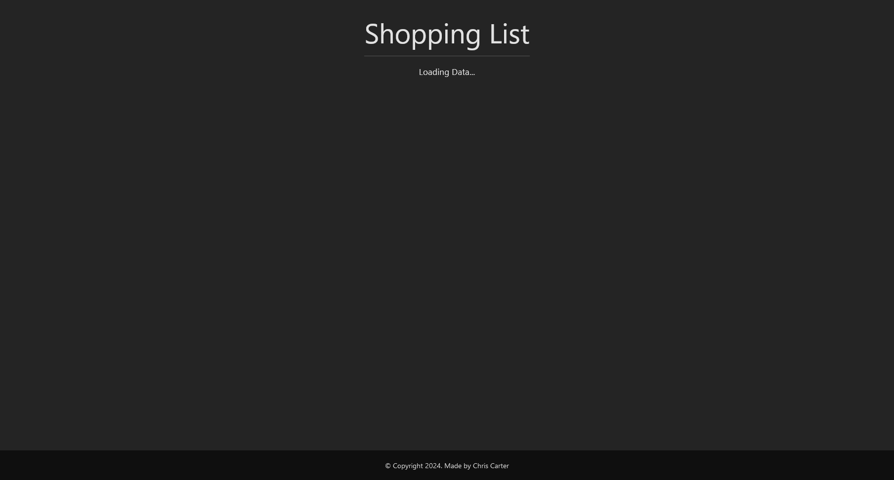
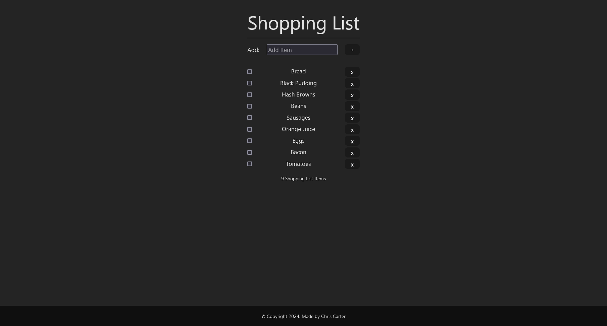
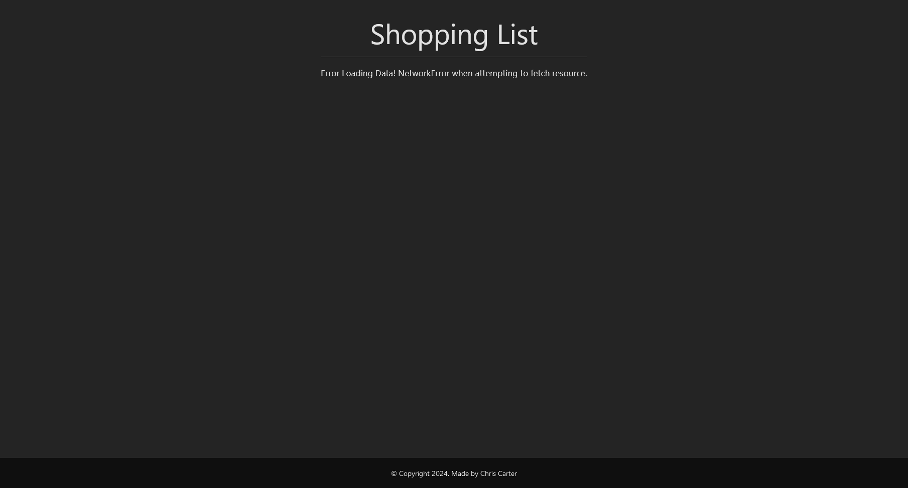
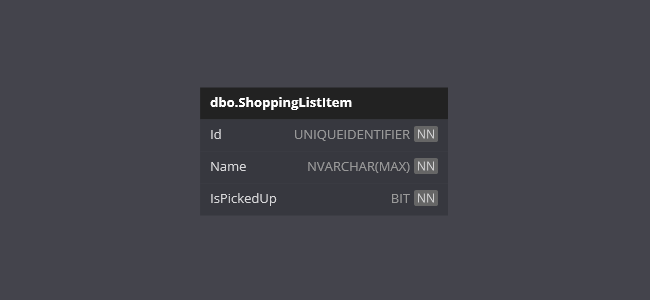

	
	<h1>Shopping List</h1>

Welcome to the **Shopping List** App!

This is a .NET and React project designed to demonstrate a full CRUD application.

It allows users to view a shopping list of items from an external API and perform CRUD operations on them!

## Features

- **Loading**: When the frontend application starts, it will show a Loading Data message.
- **Error**: If there is an error when fetching the api data, it will show an Error message.
- **Main View**: 
	- When the api data has been fetched, a list of Shopping List Items will be displayed.
	- The user can add a new Shopping List Item.
	- The user can mark an existing Shopping List Item as picked up.
	- The user can delete an existing Shopping List Item.
- **Responsive Design**: A user-friendly interface designed to work on various devices.
- **API Methods**: Create, Read, Update and Delete methods are exposed within the api application.

## Technologies

- .NET
- React
- CSS
- JavaScript
- Entity Framework Core
- SQL Server

## Getting Started

**IMPORTANT NOTE**: 

The `InitialCreate` database migration has been created.

On startup, the api application will migrate and create the database if required.

### Prerequisites

- .NET 8 SDK.
- A code editor like Visual Studio or Visual Studio Code.
- SQL Server.
- SQL Server Management Studio (optional).
- Node.js
- NPM

### Installation

1. Clone the repository:
	- `git clone https://github.com/chrisjamiecarter/shopping-list.git`

2. Navigate to the API project directory:
	- `cd ShoppingList\ShoppingList.Server`
	
3. Configure the application:
	- Update the connection string in `appsettings.json` if you require.
	
4. Build the application using the .NET CLI:
	- `dotnet build`

[OPTIONAL: Required if you do not launch via Visual Studio]

5. Navigate to the Web project directory:
	- `cd ShoppingList\shoppinglist.client`

6. Install dependencies:
	- `npm install`

### Running the Application

1. Run the API application using the .NET CLI in the API project directory:
	- `dotnet run`

2. Start the development server in the Web project directory:
	- `npm run dev`

## Usage

Once the Web application is running:

- Loading Data message will show while fetch api is run.
- View a list of Shopping List Items.
- Create a Shopping List Item.
- Mark a Shopping List Item as Picked Up.
- Delete a Shopping List Item.
- If Error message is returned, check API is running, check port running on.

### Loading Page

### Shopping List

### Error Page

## How It Works

- **Page Display**: This project was bootstrapped via Visual Studio and `create-vite` and uses React to render the components.
- **API Integration**: Fetch is used to call the External API.
- **Data Storage**: A new SQL Server database is created and the required schema is set up at run-time, or an existing database is used if previously created.
- **Data Access**: Interaction with the database is via Entity Framework Core.

## Database

## Contributing

Contributions are welcome! Please fork the repository and create a pull request with your changes. For major changes, please open an issue first to discuss what you would like to change.

## License

This project is licensed under the MIT License. See the [LICENSE](./LICENSE) file for details.

## Contact

For any questions or feedback, please open an issue.

---
***Happy Shopping Listing!***
